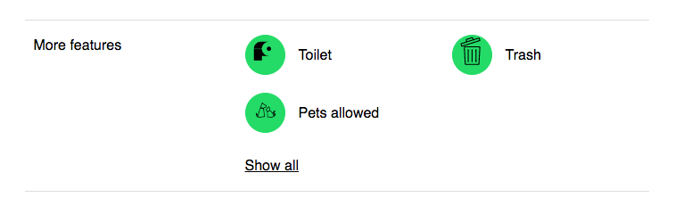
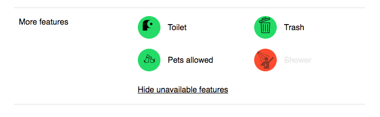

# Hipcamp

## Camping Features

The `Camping Features` section includes all the features available in a camping site, I added a little bit of color to make it clearer to the user whats available and whats not.  I also added the functionality of not only showing all the unavailable features but to also be able to hide them.





## Quick start

1. Clone this repo using `git clone --depth=1 git@github.com:victorguillen/Hipcamp.git`
2. Move to the appropriate directory: `cd Hipcamp`.<br />
3. Run `npm run setup`.<br />
4. Run `npm start`.<br />
5. Go to `http://localhost:3000`.<br />

## Project Structure

The project can be found under `app/Hipcamp` and I divided the project in 3 main folder:

```
pages: HomePage that includes the <Features /> component.
shared: constants, component/lib and images.
styles: variables, mixins, etc.
```

## React Components

### IconsContainer

I first started by creating this `IconsContainer` component with the idea of passing it 3 main props:

```
presence: PropTypes.any,
icon: PropTypes.string,
title: PropTypes.string,
```

These 3 props we essential for showing wether the feature is available or not, the type of feature it is and the icon that represents it.

```
class IconContainer extends React.Component {
  ...

  render() {
    ...
    return (
      <div className={`${iconClass} ${!presence && style.blur}`} title={title}>
        <div className={markerClass}>
          
        </div>
        {!subfeature && <p>{title}</p>}
      </div>
    );
  }
}

export default IconContainer;
```

After this I created an `IconWrapper` that renders the `Feature` or the list of `Subfeatures`.

These components are part of the shared components library.

## Sass

### Mixins

I started noticing repeated CSS so I decided to use mixins, here's an example:

```
:local(.greenMarker) {
  @include colorMarker($green);
}

:local(.redMarker) {
  @include colorMarker($red);
}
...

@mixin colorMarker($color) {
  display: flex;
  justify-content: center;
  align-items: center;
  border: solid 1px $color;
  background-color: $color;
  border-radius: 50%;
  height: 45px;
  width: 45px;
}
```

With more time I would have added more mixins to create a responsive website.

```
@mixin tablet {
  @media  #{$tablet}{
    @content;
  }
}

@mixin desktop {
  @media #{$desktop}{
    @content;
  }
}
```

## React Boilerplate

I used this [React Boilerplate][react] for a quick start on building the Camping Features assignment.

[react]: https://github.com/react-boilerplate/react-boilerplate


## License

This project is licensed under the MIT license, Copyright (c) 2017 Maximilian
Stoiber. For more information see `LICENSE.md`.

## Side Notes

It was a bit of a struggle to have to use `<ul>`'s and `<li>`'s, I'm used to structuring everything with `Flexbox` it super easy and its responsive!

One of the subfeatures is a bit off, theres a bug with an `li`'s `display: inline, float: left` to make a horizontal list, the parent css class is overwriting it to be `display: inline-block` and couldn't get that fixed in time ... ugh
